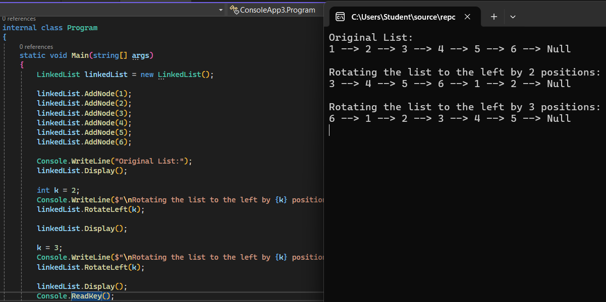
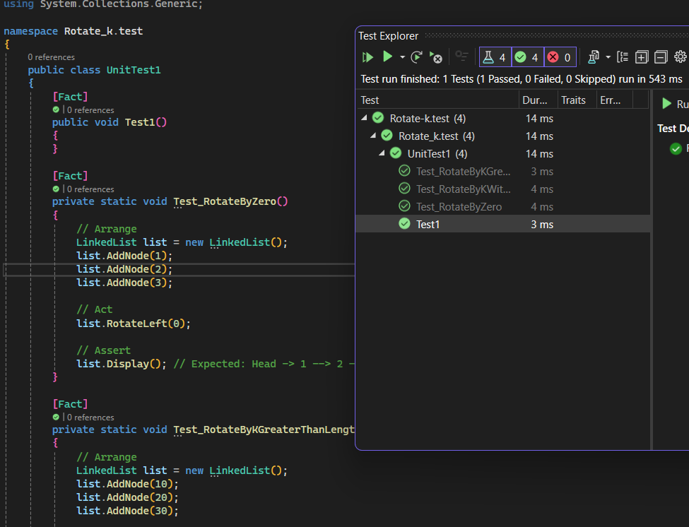

# Rotate-K
### output Rotate-K

### Test Rotate-K

## Problem Domain
Given a singly linked list, rotate it to the left by `k` places.

### Edge Cases:
- Rotating by `k = 0` should leave the list unchanged.
- If `k` is greater than the list length, use `k % length`.
- An empty list should remain unchanged.

### Algorithm
1. Calculate the length of the list.
2. Find the node at position `k`.
3. Rearrange the list so that the node at position `k` becomes the new head.
4. Ensure the tail node points to the old head.

### Time Complexity:
- Traversing the list once to calculate the length: `O(n)`.
- Adjusting the list to rotate: `O(n)`.

### Space Complexity:
- Constant space: `O(1)`.
